# _Hangman_ 

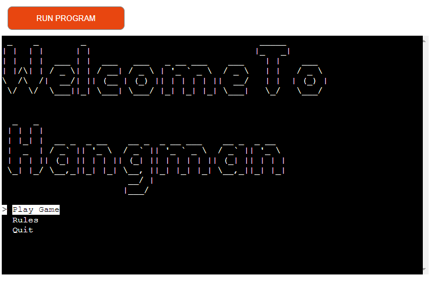

---
# Introduction

[Hangman](https://github.com/Dekeypetey40/Hangman) is a website where one can play Hangman, a classic game. The game is deployed via Heroku and one can play it [here](https://kais-hangman-project-97f7e4a4339d.herokuapp.com/). 

This website runs a hangman game created by myself, Kai Michael-Mikhail. The deployed project provides an interactive experience where the user can play against the computer as much or as little as they wish. This was made as my third project as part of Code Institue's Full Stack Developer course.

## Technologies used
- [Python](https://www.python.org/) was the programming language used to create this project.
- [VScode](https://code.visualstudio.com/) was the editor used to write my code.
- [Balsamic](https://balsamiq.com/) was used to make wireframes in the design process.
- [Lucidchart](https://www.lucidchart.com/pages/landing?utm_source=google&utm_medium=cpc&utm_campaign=_chart_en_tier2_mixed_search_brand_exact_&km_CPC_CampaignId=1520850463&km_CPC_AdGroupID=57697288545&km_CPC_Keyword=lucidchart&km_CPC_MatchType=e&km_CPC_ExtensionID=&km_CPC_Network=g&km_CPC_AdPosition=&km_CPC_Creative=442433237648&km_CPC_TargetID=kwd-33511936169&km_CPC_Country=21003&km_CPC_Device=c&km_CPC_placement=&km_CPC_target=&gclid=Cj0KCQjwib2mBhDWARIsAPZUn_kdBdBp4hO9ekx4AOZmGOKCcV9pyDfxUgekVe6bTHnD47n6XJfwfg8aAoC_EALw_wcB) was used to plan the flow of my app. 

---

## User stories
- As a first time visitor, I want to easily understand how the game works, so that I become interested in playing it.
- As a first time visitor, I want the website to be easy to interact with, so I can easily have fun playing the game.
- As a user, I want the game to be intuitive to play, so that I can play without trying to figure out how.
- As a user, I want to be able to quit the program, so that I can do something else if I wish. 
- As a returning user, I want to be able to select different difficulty levels, so that I can challenge myself.

---

# Design 
Hangman is designed to fit onto the terminal screen. A clear screen function was made to make sure the terminal does not get too cluttered. 

## Planning

### Flow Chart

A flow chart were used in the beggining stages of the design phase. 
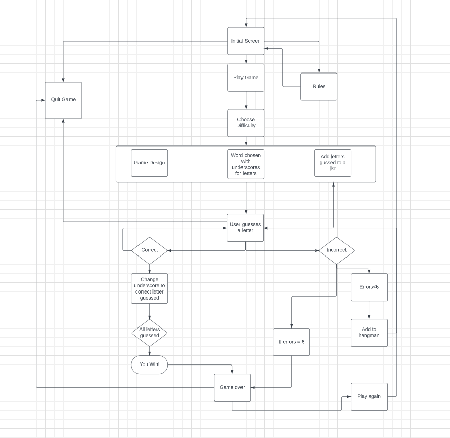 

---

# Features

## Welcome Page

- At the bottom of the terminal the user has a menu to interact with. The user navigates it with the arrow keys and presses enter to select their option. 

---

## Rules

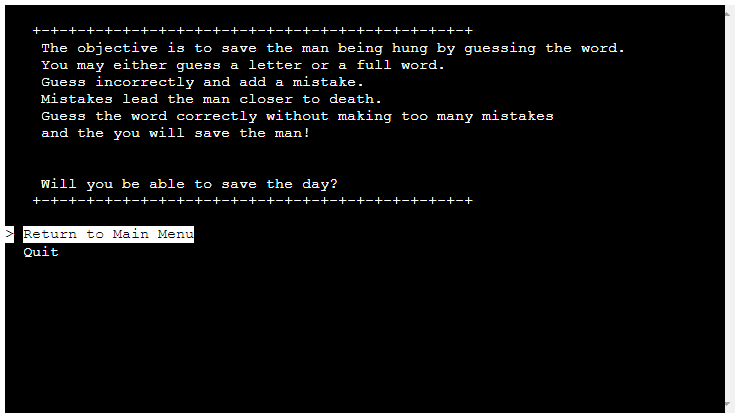

- The rules page simply explains how the game works. At the bottom of the terminal the user, again, has a menu to interact with. They may select to return to the welcome page or quit the game. 

---

## Select Difficulty
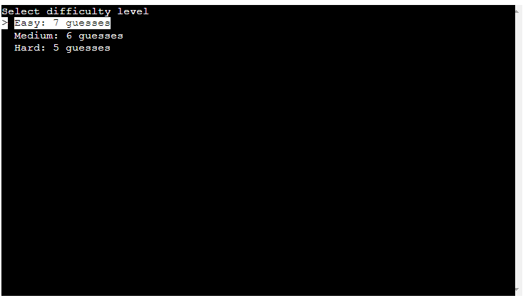 

- The user is prompted to select their difficulty level from an interactive menu.

---

## Guess the word
- The user is prompted to guess a letter or word and is told how long the word is. 
- The most guesses a user gets is 7. 
- The hangman gets more and more filled out the closer to losing the user is. 
- The letters and words guessed is added to a list and printed out for the user.
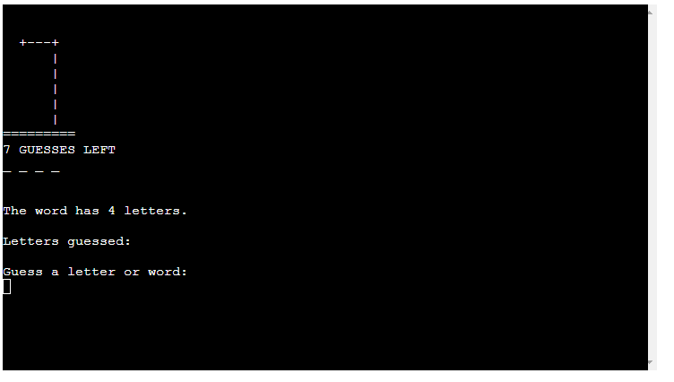 
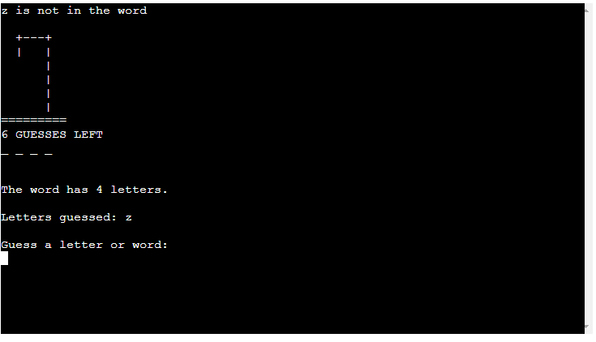 
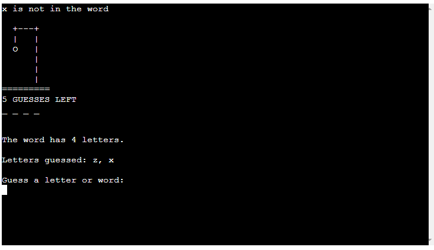 
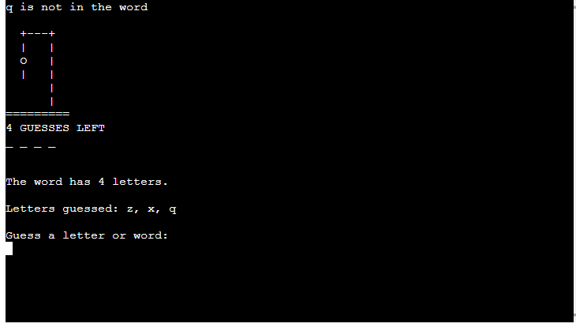 
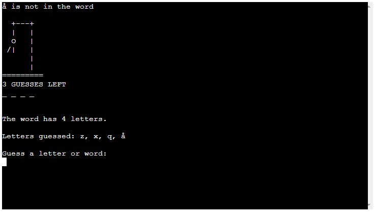 
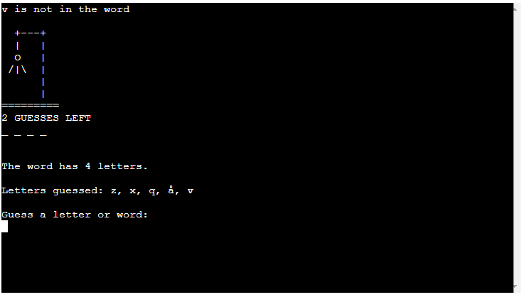 
 
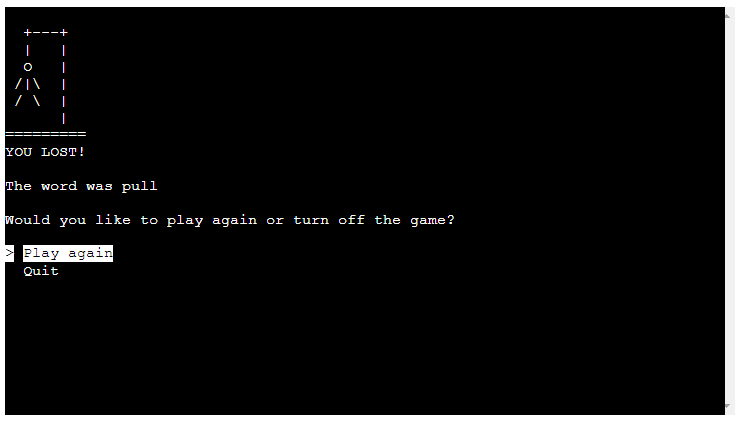 
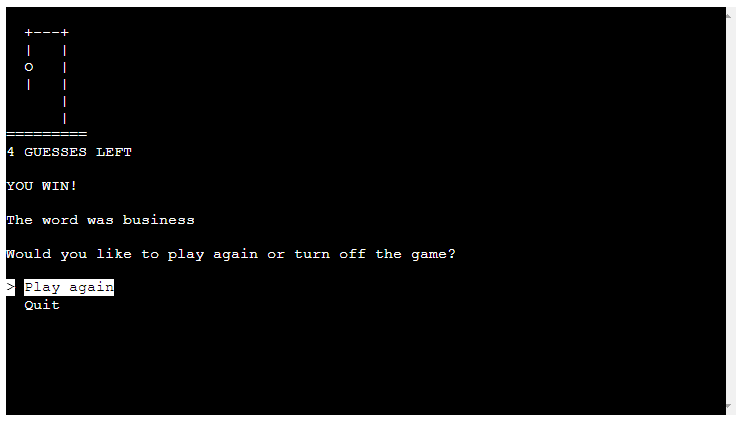 

- When the user writes invalid input, they are given are warning message indicating where they went wrong. 
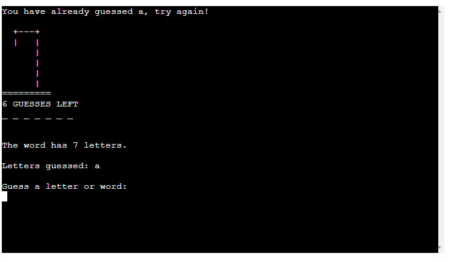
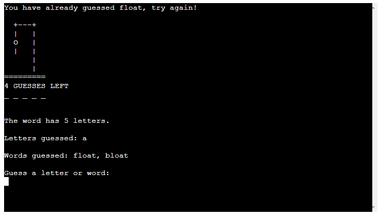
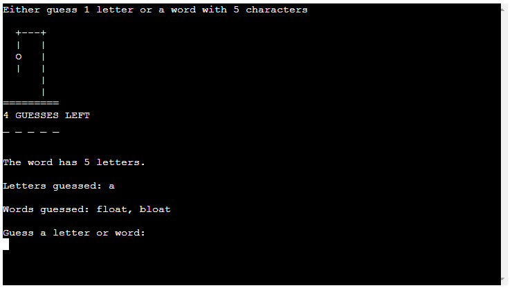
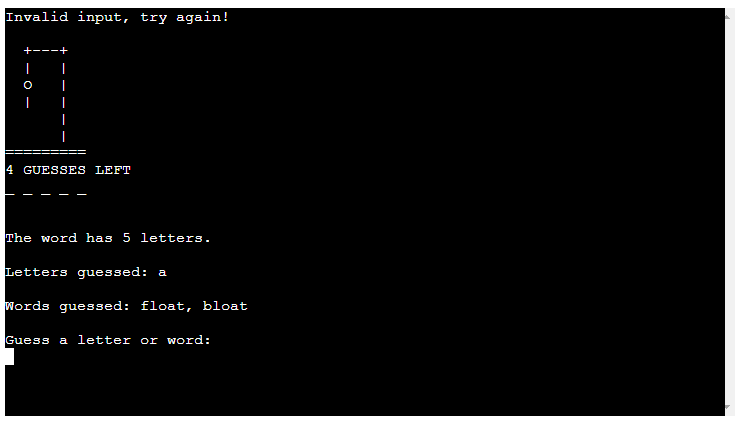

---

# Future Features
  - A leaderboard with scores
  - A player vs player game mode.
  - Changing amount of guesses to be determined by the length of the word. 

---

# Testing
 - I tested the game countless times using all elements to make sure it functioned as it should
 - When I ran into problems I used printed variables to see what the functions were returning.   
 - I tested every button to confirm that they work.
 - I gave all sorts of input into the game to try and break it, to make sure unexpected errors did not occur.   

## Validator testing

* Code Institutes [python linter](http://pep8ci.herokuapp.com/) was used to validate the code:
    - Some trailing and missing whitespaces were addressed, but there were no major issues. 
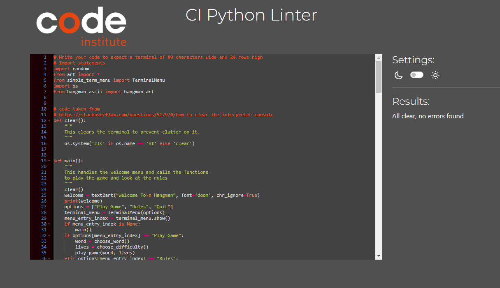
* Lighthouse in Chrome Developer Tools was used.
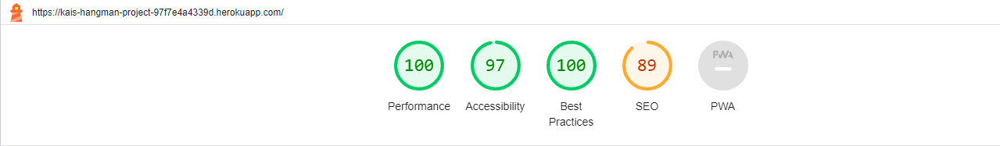

---

## Bugs

## Solved bugs
  - I was getting an error when I to keep track of the user guesses. This was solved by realizing I had made an error, which was that I made an empty dictionary instead of list to store the guesses. 

  - My code was not picking up non-alphabetical input from the user. The problem was that I had not set up an else statement to catch such input. When I did not it worked properly.
  - The app would stop running when the user ran out of guesses. 
    - The first part of the solution was to have the while loop run while the user's lives >= 0 not just >0.
    - The second part of the solution was to add a break point after the restart game function was called. If not the code would continuously ask the user to guess letters, based on the game that was already over. 

---

## Unsolved bugs

## Manual Testing

| feature | action | expected result | tested | passed | comments |
| --- | --- | --- | --- | --- | --- |
| Welcome Screen Menu | | | | | |
| Play Game Option | Select Play Game | The play_game function runs | Yes | Yes |  |
| Rules Option | Select Rules | The rules function runs | Yes | Yes |  |
| Quit Option | Select quit | The program turns off. | Yes | Yes |  |
| Rules Menu | | | | | |
| Return to Main Menu | Select return to main menu | The user is taken back to the welcome screen. | Yes | Yes |  |
| Quit Option | Select quit | The program turns off. | Yes | Yes |  |
| Select Difficulty | | | | | |
| Easy Option | Select easy | The program runs the play game function and assigns the user 7 lives. | Yes | Yes |  |
| Medium Option | Select medium | The program runs the play game function and assigns the user 6 lives. | Yes | Yes |  |
| Hard Option | Select hard | The program runs the play game function and assigns the user 5 lives. | Yes | Yes |  |
| Guess the word | | | | | |
| Input: single letter | Write a single letter, and then test an invalid character | If a single letter is inputted it is added to a list and printed for the user. If it was correct its position in the word is shown to the user, if incorrect the hangman picture updates. If an invalid character is chosen, an error message appears and tells the user to try again. | Yes | Yes |  |
| Input: word | Write a word with same length as the answer, and then test invalid characters | If a word of same length is inputted it is added to a list and printed for the user. If it was correct the user is informed they have won, if incorrect the hangman picture updates. If an invalid character is chosen, an error message appears and tells the user to try again. | Yes | Yes |  |
| Restart Game | | | | | |
| Play Again Option| Select the play again option | The player is taken back to the welcome screen | Yes | Yes | |
| Quit Option | Select quit | The program turns off. | Yes | Yes |  |

---

# Deployment

* This site was deployed by completing the following steps:

1. Log in to [Heroku](https://id.heroku.com) or create an account.
2. On the main page click the button labelled New in the top right corner and from the drop-down menu select Create New App.
3. You must enter a unique app name.
4. Select your region.
5. Click Create App .
6. Navigate to the settings tab and then to Config Vars.
7. Click Reveal Config Vars and enter port into the Key box and 8000 into the Value box and click the Add button.
8. Next, scroll down to the Buildpack section click Add Buildpack select python and click Save Changes.
9. Repeat step 8 to add node.js. o Note: The Buildpacks must be in the correct order. If not click and drag them to move into the correct order.
10. Scroll to the top of the page and choose the Deploy tab.
11. Select Github as the deployment method.
12. Confirm you want to connect to GitHub.
13. Search for the repository name and click the connect button.
14. Scroll to the bottom of the deploy page and select the preferred deployment type.
15. Click either Enable Automatic Deploys for automatic deployment when you push updates to Github.

---
# Credits

## Content
- A huge thank you to my mentor Aleksei Konovalov for all of his help throughout this process.
- Inspiration for my button design was taken from Code Institute's Love Maths project and was adapted to suit my website.
- The method of functions returning a value as an array was taken from [scaler.com](https://www.scaler.com/topics/javascript-return-multiple-values/).
- The code for the reset button was taken from [Stack Overflow](https://stackoverflow.com/).

---

## Media
  - Icon for my website was taken from [Flaticon](https://www.flaticon.com/)
  - Font Awesome was used for the logo header and the element buttons. 

Creds
Libraries
art 6.0 for ASCII art library https://pypi.org/project/art/
https://blessed.readthedocs.io/en/latest/ to color stuff
Simple Terminal Menu https://pypi.org/project/simple-term-menu/
Wordbank taken from https://github.com/Xethron/Hangman/blob/master/words.txt
The method to replace underscores with letters and print it out inspired by https://www.youtube.com/watch?v=DLurhc1i5_4&ab_channel=MikhaHarly